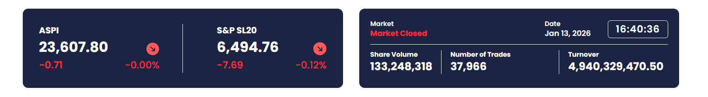

CSEpal.lk 
    Issues: 
     * Data Representation is complicated
     * Different tabs to represent different values 
          - Report Data
              - Income
              - Financial
              - Cash Flow
                 - Past #of data Representation according to the user input
              - More than 3 charts for each one above
          - Report Calculations
              - Income
              - Financial
              - Cash Flow
              - Past #of data Representation according to the user input
              - More than 3 charts for each one above
          - Report Ratios
             - add a table
          - Valuations
             - add a table
             - add a simple chart
          - Forecasting
             - add another tab
          - Add a company detail tab
       * Add a Quarter Report Comparison Tab
          - Add different tables for each Income, Financial and Cash Flow

Simply Walls
    - Add a Profile for this one 
          - add profile modifications
          - add a portfolio
    - Preview All Stocks
    - Add a Watchlist
    - Add Sector Sections -> banks etc....

    - provide the users to download the data in any file format

    Name : BuySonLab -> 1st Name

    -> src -> components -> Pages -> Landing Page -> Hero section.tsx
                                                     Table section.tsx
                                                     third.....tsx
                                       Stock Page -> section1.tsx
                                                      section2.tsx
                            Common -> Header.tsx
                                      Footer.tsx

                            ui     -> Component1.tsx
                                      comp....tsx

--push --

  henuka -> dev :  dev -> henuka
  osanda -> dev :  dev -> osanda

  (after)
  dev -> main

                pages ->  Landing Page -> page.tsx
                          section Page -> page.tsx

ui -> BlurText.tsx -> npm install motion                      
      Particles.tsx -> npx shadcn@latest add @react-bits/Particles-TS-TW

localhost:3000/report_data/income  -  url for report data from there navigate through the nav bar

//dep
npm install framer-motion   
npm install ogl 
//new one- > npm install gsap @gsap/react

//add button next to target to add it to the watchlist in Stocks Fundamentals page

Bank -> HNB -> 2024 -> statements.json
                       shareholder.json
                       totalshares.josn
                       subs.json
                        
               2023 -> statements.json
                       shareholder.json
                       totalshares.josn
                       subs.json

        SDB -> 2024 -> statements.json
                       shareholder.json
                       totalshares.josn
                       subs.json

Sector ->                                                  

Sector_Name_year.pdf
Bank_HNB_2024.pdf

expected outcomes : 

